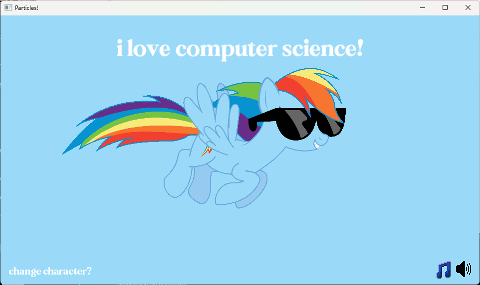

# Particles! A Particularly Pony-ish Project

# How to Run (Windows)

Follow these steps to download and run **Particles!** on your Windows PC:

## 1. DOWNLOAD THE FILES

- Click the green **"Code"** button on the GitHub page.
- Select **"Download ZIP"**.
- Extract the ZIP file somewhere on your computer.

## 2. MOVE THE ASSETS FOLDER

- Inside the extracted folder, you'll see two folders:
  - `Particles!`
  - `assets`
- Drag the entire **`assets`** folder **into** the `Particles!` folder.  
  It should look like this:

  - `Particles!\`
      - `Particles!.exe`
      - `(SFML .dll files)`
      - `assets`
          - `(images, music, etc.)`

## 3. RUN THE GAME

- Open the `Particles!` folder.
- Double-click `Particles!.exe` to launch the game.

## ⚠️ IMPORTANT

- This game only works on **Windows**.
- The `assets` folder **must be inside** the `Particles!` folder or the game will not work.

# HOW TO RUN/DEBUG IN VISUAL STUDIO

To build or debug **Particles!** from source using Visual Studio:

1. **Additional Include Directories:**  
   `C:\SFML\include`

2. **Additional Library Directories:**  
   `C:\SFML\lib`

3. **Additional Dependencies:**  
   *(Paste this at the beginning of the list)*  
   `sfml-graphics-d.lib;sfml-window-d.lib;sfml-system-d.lib;sfml-audio-d.lib;`
